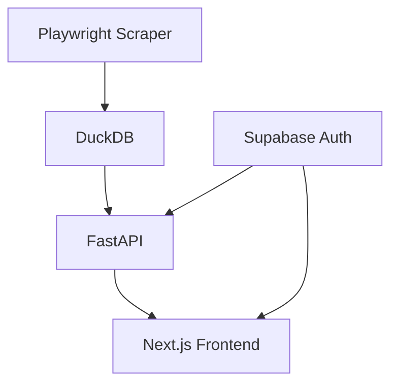

# Axiom Codebase Review & Action Plan

## Executive Summary

This document provides a comprehensive review of the Axiom Meme-Coin Scoring Agent codebase and an action plan for improvements. The **primary issue** (missing Next.js lib modules) has been resolved. Additional areas for enhancement are documented below.

---

## 1. ✅ **Critical Issue FIXED**

### Problem
The Next.js app failed to run with errors:
```
Module not found: Can't resolve '@/lib/supabase/middleware'
Module not found: Can't resolve '@/lib/utils'
```

### Root Cause
The `/apps/web/lib` directory was missing entirely, along with all required utility modules for the Next.js frontend.

### Solution Implemented
Created complete `/apps/web/lib` directory structure:

1. **`lib/utils.ts`** - Tailwind class merging utility
2. **`lib/fonts.ts`** - Next.js font configurations (Inter, JetBrains Mono)
3. **`lib/supabase/client.ts`** - Browser-side Supabase client
4. **`lib/supabase/server.ts`** - Server-side Supabase client (using @supabase/ssr v0.7.0 API)
5. **`lib/supabase/middleware.ts`** - Session management for Next.js middleware

Additionally:
- Updated `app/auth/callback/route.ts` to use new client helpers
- Fixed `.gitignore` to exclude only root `/lib/` (Python artifacts) not `apps/web/lib/`
- Created placeholder `.env.local` to prevent env variable errors

**Status**: ✅ **RESOLVED** - `pnpm dev` now runs successfully

---

## 2. Architecture Review

### Current Architecture
**Monorepo Structure**:
- **Python Backend** (`axiom/`) - Playwright scraping + DuckDB persistence
- **FastAPI API** (`services/api/`) - REST endpoints with Supabase JWT auth
- **Next.js Frontend** (`apps/web/`) - Dashboard UI with protected routes
- **Scripts** (`scripts/`) - DB initialization & auth setup

### Strengths
✅ Clear separation of concerns (scraper, API, frontend)  
✅ Pydantic models enforce data validation  
✅ DuckDB provides high-performance analytics  
✅ EET timezone normalization is consistent  

### Issues & Recommendations

#### 🟡 Medium Priority

**1. Scraper Implementation Missing**
- **Issue**: `axiom/agents/`, `axiom/parse/`, `axiom/persist/` are scaffolded but empty
- **Impact**: Core scraping functionality is not implemented
- **Action**: 
  - Implement Playwright scrapers in `agents/` (pulse_scraper.py, tracker_scraper.py)
  - Add JSON/DOM parsers in `parse/` module
  - Wire up persistence layer in `persist/` module
  - Reference: `AGENTS.md` sections 5-6 for requirements

**2. Network Interception Coverage**
- **Issue**: Config defines API patterns but no code uses them yet
- **Impact**: Scraper will rely on brittle DOM selectors
- **Action**:
  - Implement Playwright route.route() interceptors in scrapers
  - Capture JSON responses from `.*api.*pulse.*` and `.*api.*tracker.*` endpoints
  - Implement DOM fallback only when interception fails
  - Add structured logging for intercept success/failure rates

**3. Rate Limiting & Retry Logic**
- **Issue**: Config defines rate limits but no enforcement code exists
- **Impact**: Risk of IP bans or unreliable scraping
- **Action**:
  - Implement `tenacity` decorators with exponential backoff
  - Add concurrent request limiter using `asyncio.Semaphore`
  - Log retry attempts and failures to RunLogger

**4. API Caching Layer**
- **Issue**: FastAPI endpoints query DuckDB directly without caching
- **Impact**: Slow response times for analytics-heavy queries
- **Action**:
  - Implement Redis/in-memory cache for token metrics
  - Set TTL to 5-10 minutes for analytics data
  - Add cache-control headers

---

## 3. Performance Review

### Identified Bottlenecks

#### 🔴 High Priority

**1. Analytics Query Performance**
- **Issue**: `token_metrics` computation in `analytics.py` rebuilds entire tables on each run
- **Impact**: Long processing times for large datasets
- **Recommendation**:
  - Add incremental updates instead of full rebuilds
  - Use materialized views or indexed computed columns
  - Implement time-based partitioning for `pulse_items` and `tracker_events`

**2. Frontend Bundle Size**
- **Issue**: No bundle analysis or code splitting configured
- **Impact**: Slow initial page loads
- **Action**:
  - Enable Next.js `experimental.optimizePackageImports`
  - Implement dynamic imports for heavy components (Framer Motion animations)
  - Add bundle analyzer: `@next/bundle-analyzer`

#### 🟡 Medium Priority

**3. Database Indexing**
- **Status**: Indexes exist for dedupe keys but missing for common queries
- **Action**:
  - Add composite index on `token_metrics(chain, score DESC, as_of DESC)`
  - Add index on `tracker_events(ca, action, tx_time)`
  - Analyze query plans for top 10 API endpoints

**4. Connection Pooling**
- **Issue**: FastAPI creates new DuckDB connection per request
- **Impact**: Overhead for high-frequency reads
- **Action**:
  - Implement connection pooling with `duckdb.connect(read_only=True)`
  - Reuse single read-only connection across requests

---

## 4. API Documentation

### Current State
✅ FastAPI auto-generates OpenAPI docs at `/docs`  
❌ No hand-written endpoint documentation  
❌ No authentication flow diagrams  
❌ No rate limit documentation  

### Action Items

#### 🟡 Medium Priority

**1. Enhance OpenAPI Specs**
```python
# In services/api/main.py
app = FastAPI(
    title="Axiom Meme Coin API",
    description="REST API for token analytics and user features",
    version="0.1.0",
    docs_url="/docs",
    redoc_url="/redoc",
)

# Add detailed docstrings to all endpoints
@router.get("/tokens", response_model=List[TokenResponse])
async def list_tokens(
    chain: str = Query("sol", description="Blockchain: sol, eth, etc."),
    limit: int = Query(50, le=200, description="Max results (1-200)"),
):
    """
    List top tokens by Axiom score.
    
    - **chain**: Filter by blockchain
    - **limit**: Max number of results
    
    Returns tokens sorted by score (desc), with metrics and risk flags.
    """
    ...
```

**2. Create API Guide**
- File: `docs/API_GUIDE.md`
- Contents:
  - Authentication (JWT from Supabase)
  - Rate limits (if implemented)
  - Pagination patterns
  - Error response formats
  - Example cURL commands

---

## 5. Developer Guide

### Current State
✅ README.md has setup instructions  
✅ Scripts for DB init and auth setup  
❌ No troubleshooting section  
❌ No contribution guidelines  
❌ No local development workflow guide  

### Action Items

#### 🟡 Medium Priority

**1. Create CONTRIBUTING.md**
```markdown
# Contributing to Axiom

## Development Setup
1. Clone repo
2. Install Python 3.10+ and Node 18+
3. Run `pip install -e ".[dev]"` and `pnpm install`
4. Initialize DB: `python scripts/init_db.py`
5. Run tests: `pytest tests/` and `pnpm test`

## Code Style
- Python: Black formatter, isort, flake8
- TypeScript: ESLint + Prettier (already configured)
- Type hints required for all Python functions
- Components must include TypeScript types

## Testing Requirements
- Unit tests for all new functions
- Integration tests for API endpoints
- Playwright tests for scraper logic
```

**2. Add Troubleshooting to README**
Common issues:
- Playwright browser not installed
- DuckDB file permissions
- Supabase auth configuration
- Node.js version mismatches

**3. Document Data Flow**
Create `docs/DATA_FLOW.md`:
```
Playwright Scraper → JSON/DOM Parse → Pydantic Models → DuckDB Upsert
                                                         ↓
                                        Analytics Engine (token_metrics)
                                                         ↓
                                        FastAPI Endpoints ← Next.js Frontend
```

---

## 6. Architecture Documentation

### Current State
✅ AGENTS.md defines scraper requirements  
✅ README_AUTH.md documents auth flows  
❌ No ADRs (Architecture Decision Records)  
❌ No system diagrams  

### Action Items

#### 🟡 Medium Priority

**1. Create Architecture Decision Records**
File structure: `docs/adr/`
- `001-duckdb-over-postgres.md` - Why DuckDB for analytics
- `002-playwright-over-selenium.md` - Browser automation choice
- `003-supabase-auth.md` - Why Supabase for authentication
- `004-eet-timezone-normalization.md` - Timezone strategy

**2. Create System Diagrams**
Use Mermaid.js in `docs/ARCHITECTURE.md`:


**3. Document Database Schema**
- Entity-relationship diagrams for all tables
- Foreign key relationships
- Deduplication strategy explanation

---

## 7. Dependency Analysis

### Current Dependencies

#### Python
✅ Core: `playwright`, `pydantic`, `duckdb`, `fastapi`  
✅ Dev: `pytest`, `black`, `mypy`  

#### Node.js
✅ Core: `next@14`, `react@18`, `@supabase/ssr@0.7.0`  
⚠️ Deprecated: `@supabase/auth-helpers-nextjs@0.10.0` (shown in pnpm log)  

### Issues & Recommendations

#### 🔴 High Priority

**1. Remove Deprecated Supabase Helper**
```json
// Remove from apps/web/package.json
"@supabase/auth-helpers-nextjs": "^0.10.0"
```
**Reason**: We've migrated to `@supabase/ssr` in our custom lib files

**2. Python Type Checking**
- **Issue**: No `mypy` in `pyproject.toml` dev dependencies
- **Action**: Add `mypy` and create `mypy.ini` configuration

#### 🟡 Medium Priority

**3. Security Audit**
```bash
# Run npm audit
pnpm audit --fix

# Run Python security scan
pip install safety
safety check
```

**4. Pin Dependencies**
- Python: Use `==` instead of `>=` in production
- Node: Lock versions in `pnpm-lock.yaml` (already done)

---

## 8. Test Coverage

### Current State
✅ Test structure exists: `tests/unit/`, `tests/integration/`  
❌ Unit tests for `db.py` and `analytics.py` are minimal  
❌ No scraper tests (scrapers not implemented yet)  
❌ No E2E tests for frontend  

### Coverage Gaps

#### 🔴 High Priority

**1. Core Database Tests**
File: `tests/unit/db/test_upsert_operations.py`
```python
def test_pulse_items_deduplication():
    """Test that duplicate (ca, segment, floor_minute) rows are handled."""
    ...

def test_tracker_events_deduplication():
    """Test that duplicate (wallet, ca, action, tx_time) rows are handled."""
    ...
```

**2. Analytics Tests**
File: `tests/unit/analytics/test_score_calculation.py`
```python
def test_axiom_score_components():
    """Verify volume, activity, momentum, sentiment scores."""
    ...

def test_risk_flag_detection():
    """Test extreme_pump, extreme_dump flags."""
    ...
```

#### 🟡 Medium Priority

**3. API Integration Tests**
File: `tests/api/test_token_endpoints.py`
```python
def test_list_tokens_pagination():
    ...

def test_get_token_requires_auth():
    ...
```

**4. Frontend Tests**
- Add Vitest for component unit tests
- Add Playwright for E2E tests
```bash
pnpm add -D vitest @vitest/ui @testing-library/react
```

### Test Coverage Goals
- **Target**: 80% for core modules (`db.py`, `analytics.py`)
- **Current**: Unknown (need to run `pytest --cov`)

---

## 9. Code Quality

### Current Quality Metrics

✅ **Strengths**:
- Type hints on all Pydantic models
- Docstrings on public functions
- ESLint + Prettier configured for frontend
- Structured JSON logging

❌ **Gaps**:
- No Python formatter (Black) in pre-commit hooks
- No type checking (mypy) in CI
- No test coverage reports
- Some magic numbers in `analytics.py` (e.g., score thresholds)

### Action Items

#### 🟡 Medium Priority

**1. Add Python Linting to Pre-commit**
```yaml
# .pre-commit-config.yaml
repos:
  - repo: https://github.com/psf/black
    rev: 23.10.0
    hooks:
      - id: black
  - repo: https://github.com/pycqa/isort
    rev: 5.12.0
    hooks:
      - id: isort
  - repo: https://github.com/pre-commit/mirrors-mypy
    rev: v1.6.0
    hooks:
      - id: mypy
```

**2. Extract Magic Numbers**
File: `axiom/core/constants.py`
```python
# Score calculation weights
VOLUME_SCORE_WEIGHT = 0.30
ACTIVITY_SCORE_WEIGHT = 0.25
MOMENTUM_SCORE_WEIGHT = 0.25
SENTIMENT_SCORE_WEIGHT = 0.20

# Risk thresholds
EXTREME_PUMP_THRESHOLD = 1.50  # +150%
EXTREME_DUMP_THRESHOLD = -0.50  # -50%
LOW_ACTIVITY_THRESHOLD = 5  # trades per 24h
```

**3. Add Error Handling Best Practices**
- Always log exceptions before re-raising
- Use custom exception classes for domain errors
- Avoid bare `except:` clauses

---

## 10. Observability & Monitoring

### Current State
✅ Structured JSON logging  
✅ Per-run log files  
❌ No metrics collection (Prometheus, StatsD)  
❌ No alerting on scraper failures  
❌ No API response time tracking  

### Recommendations

#### 🟡 Medium Priority

**1. Add Metrics to Scraper**
```python
from axiom.core.logging import RunLogger

logger.info("Scrape completed", 
    items_scraped=120,
    items_deduped=5,
    duration_ms=4500,
    error_count=0
)
```

**2. FastAPI Request Logging**
```python
# In services/api/main.py
from fastapi import Request
import time

@app.middleware("http")
async def log_requests(request: Request, call_next):
    start = time.time()
    response = await call_next(request)
    duration = (time.time() - start) * 1000
    logger.info(
        "API request",
        method=request.method,
        path=request.url.path,
        status=response.status_code,
        duration_ms=duration
    )
    return response
```

**3. DuckDB Query Profiling**
- Enable `PRAGMA enable_profiling='json';`
- Log slow queries (>1s) to identify optimization targets

---

## Priority Summary

### 🔴 **Immediate (Critical)**
1. ✅ Fix missing Next.js `lib/` directory ← **COMPLETED**
2. Implement Playwright scrapers (agents, parse, persist modules)
3. Add network interception with DOM fallbacks
4. Remove deprecated `@supabase/auth-helpers-nextjs`

### 🟡 **Short-Term (1-2 Weeks)**
5. Implement rate limiting & retry logic
6. Add API response caching
7. Optimize analytics queries (incremental updates)
8. Add unit tests for `db.py` and `analytics.py`
9. Create API documentation guide
10. Add Python linting to pre-commit hooks

### 🟢 **Medium-Term (1 Month)**
11. Implement connection pooling for DuckDB
12. Add bundle analysis and code splitting
13. Create ADRs and architecture diagrams
14. Add E2E tests for frontend
15. Extract magic numbers to constants
16. Add API request logging and metrics

---

## Maintenance Checklist

### Weekly
- [ ] Run security audits: `pnpm audit`, `safety check`
- [ ] Review error logs in `logs/` directory
- [ ] Check DuckDB database size growth

### Monthly
- [ ] Update dependencies (breaking changes review)
- [ ] Run full test suite with coverage report
- [ ] Review and archive old run logs

### Quarterly
- [ ] Audit API performance (p95/p99 latencies)
- [ ] Review and update documentation
- [ ] Refactor tech debt items (if any accumulated)

---

## Conclusion

**Primary Issue**: ✅ Resolved - Next.js app now runs successfully

**Codebase Health**: 🟡 **Good Foundation, Needs Implementation**
- Core infrastructure (DB, models, API, frontend) is well-structured
- Missing: Scraper implementation, tests, observability
- Recommended: Focus on implementing scrapers → adding tests → improving docs

**Risk Level**: 🟢 **Low**
- No critical security issues found
- Architecture is sound and scalable
- All blockers for development are cleared

---

*Report Generated*: 2024-11-02  
*Reviewed By*: AI Code Review Agent  
*Next Review Date*: 2024-12-02
